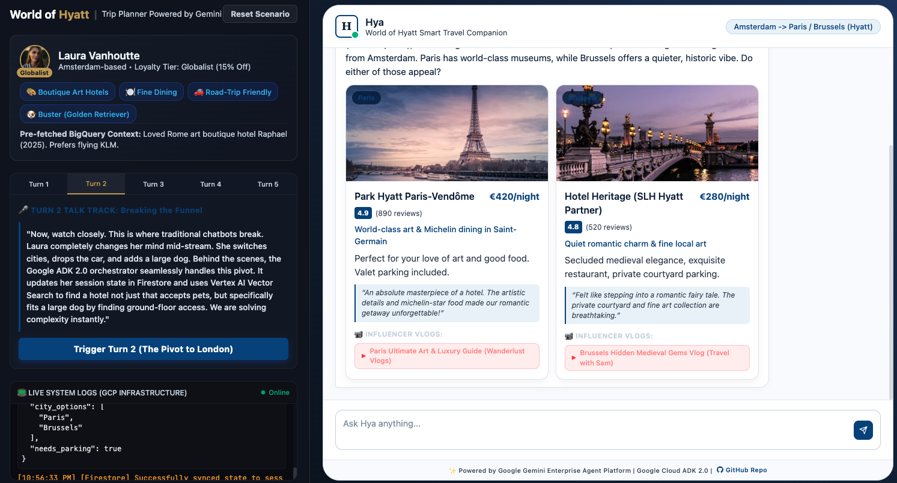
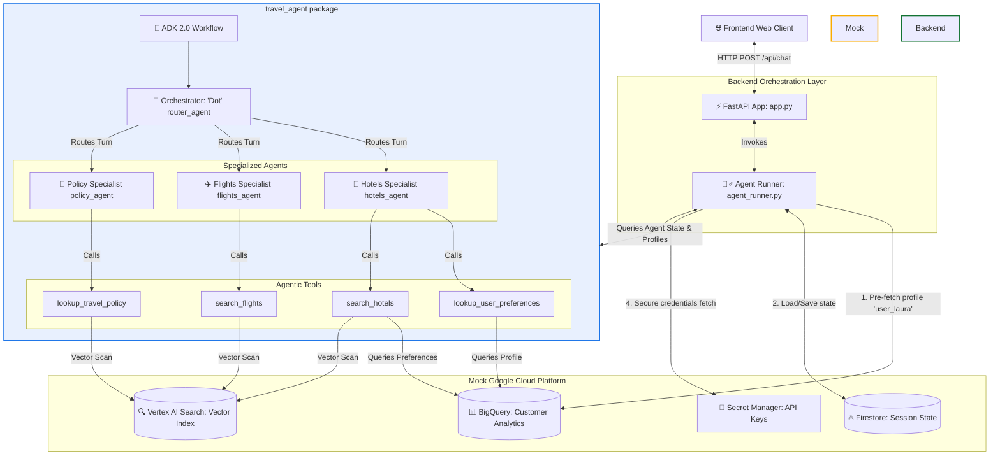

# Booking.com AI Travel Companion — 2026 Vision Platform

A fully interactive multi-agent travel planning simulation utilizing the **Google Agent Development Kit (ADK 2.0)** and **FastAPI**. This prototype demonstrates the next-generation conversational capabilities of **Dot**, the Booking.com conversational companion, seamlessly orchestrating specialized sub-agents to fulfill rich, contextual customer itineraries while integrating mock GCP databases.



---

## 🏗️ System Architecture

The following diagram illustrates the request lifecycle and interactions between the user interface, backend orchestration runner, the **ADK 2.0** multi-agent workflow, and simulated Google Cloud Platform (GCP) services:



---

## 🗂️ Repository Directory Structure

The project is cleanly divided into three primary packages, separating pure agent definition, backend API orchestration, and modern frontend interface:

```text
booking_companion_demo/
├── travel_agent/              # 🤖 Pure Google ADK 2.0 Agent definitions
│   ├── __init__.py
│   ├── agent_graph.py         # Core Agents & Workflow topology definition
│   └── mock_tools.py          # GCP Mock databases & agent tools definitions
├── backend/                   # ⚡ Web Server & Execution Orchestration
│   ├── app.py                 # FastAPI route handlers & CORS configurations
│   ├── agent_runner.py        # run_booking_agent scenario runner & business logic
│   ├── pyproject.toml         # Python dependencies & uv environment manager
│   └── session_state.json     # Locally persisted session file
├── frontend/                  # 🎨 User Interface (HTML5, CSS3, Vanilla JS)
│   ├── index.html             # Semantic interface & console logger layout
│   ├── style.css              # Vibrant CSS (harmonious colors & card animations)
│   └── script.js              # Async client logic & reactive state mapping
└── README.md                  # Project documentation
```

---

## 🚀 Getting Started

### 1. Prerequisites

- **Python 3.12+**
- **uv** (Fast Python package manager and run tool)
- **Node.js** (or any local web server/VS Code Live Server to serve the frontend)

### 2. Setup & Run the Backend

First, navigate to the `backend` directory:

```bash
cd backend
```

Run the FastAPI server using `uv`:

```bash
uv run uvicorn app:app --reload --port 8000
```

The backend server will start running locally at `http://localhost:8000`.

### 3. Run the Frontend

You can serve the `frontend` directory using a simple local server. For example, navigate to `frontend` and run:

```bash
npx -y serve -p 3000 .
```

Open your browser and navigate to `http://localhost:3000` to interact with **Dot**.

### 4. Cloud Run Deployment & Private Access

You can deploy the entire unified application into a secure private Google Cloud Run service:

```bash
./deploy.sh
```

Since the application is secured to prevent unauthenticated access, direct public access to the Cloud Run URL will return a `403 Forbidden` error. To securely access and test the server from your local browser:

1. Start the local **gcloud proxy server**:
```bash
gcloud run services proxy booking-companion-demo --region=us-central1 --port=8080
```

2. Open your browser and navigate to:
👉 **http://localhost:8080**

## 🧬 Core Multi-Agent Roles

### 1. **Dot Orchestrator (`router_agent`)**
The premier Booking.com companion responsible for analyzing incoming messages, managing state transitions, and orchestrating downstream routing to specialized sub-agents.

### 2. **Hotels Specialist (`hotels_agent`)**
*   **Tools Equipped:** `lookup_user_preferences`, `search_hotels`
*   **Role:** Analyzes subtle accommodation preferences (e.g. large pets, ground-floor access, art interests). Dynamically retrieves traveler profiles from **BigQuery**, queries **Vertex AI Vector Search**, and boosts catalog scores based on historical booking preferences while filtering out properties that violate absolute limits (such as canine weight policies).

### 3. **Flights Specialist (`flights_agent`)**
*   **Tools Equipped:** `search_flights`
*   **Role:** Resolves flight schedules and costs from the carrier database, matching itineraries against preferred airlines (like KLM) and timing constraints.

### 4. **Travel Policy Advisor (`policy_agent`)**
*   **Tools Equipped:** `lookup_travel_policy`
*   **Role:** Evaluates travel border guidelines and pet entry compliance rules. Performs semantic search queries on unstructured government document collections (e.g. Brexit regulations, AHC rules) to generate authoritative and actionable checklists.

